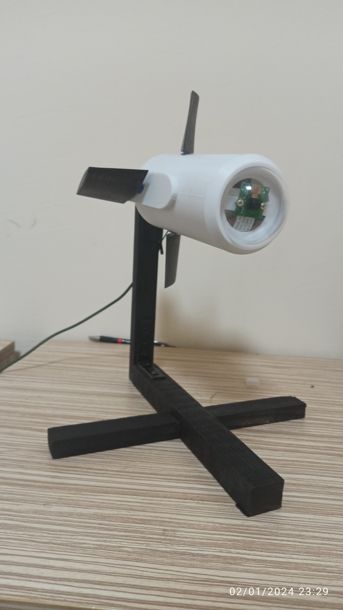

# YUSUF EMRE AKDENİZ
**Mekatronik Mühendisi | Donanım Tasarım Mühendisi | Gömülü Sistemler Geliştiricisi**

📍 **Konum:** Düzce, Türkiye
✉️ **E-posta:** ysfmrakdeniz@gmail.com
🔗 **LinkedIn:** [linkedin.com/in/ysfmrakdeniz](https://linkedin.com/in/ysfmrakdeniz)
💻 **GitHub:** [github.com/ysfmrakdeniz](https://github.com/ysfmrakdeniz)

---

## 👤 PROFİL ÖZETİ
Düzce Üniversitesi Mekatronik Mühendisliği bölümünde yüksek lisans eğitimime devam ediyorum. Aviyonik sistem tasarımı, roket teknolojileri ve havacılık donanım geliştirme alanlarında dört yılı aşkın uygulamalı tecrübem bulunuyor.
TEKNOFEST ve IREC yarışmalarında Aviyonik Takım Kaptanı ve Sistem Tasarımcısı sorumluluklarını üstlenerek projelerin konsept aşamasından operasyonuna kadar olan süreçleri yönettim. Bu görevler kapsamında uçuş bilgisayarları, telemetri sistemleri ve otonom kontrol kartları tasarladım.
Son olarak Soylu Aerospace bünyesinde Donanım Tasarım Mühendisi olarak görev yaptım. MIL-STD-704 ve DO-160 standartlarına uygun, STM32H7 tabanlı otonom uçuş kontrol kartlarını ve çeşitli sistemlerin geliştirme süreçlerini yürüttüm.

---

## 🎓 EĞİTİM BİLGİLERİ

**Y. Lisans — Mekatronik Mühendisliği**
*Düzce Üniversitesi*
- Tez: Hava Araçlarında Makine Öğrenmesi ile Erken Arıza Tespiti

**Lisans — Mekatronik Mühendisliği**
*Düzce Üniversitesi*
- Mezuniyet: Ağustos 2024
- Genel Not Ortalaması (GNO): 3.19 / 4.00

**Yabancı Dil:** İngilizce (B1 — Orta Seviye)

---

## 💼 İŞ VE STAJ DENEYİMİ

### Donanım Tasarım Mühendisi | Soylu Aerospace A.Ş.
*Kas 2024 — Devam ediyor*

**Uygulanan Standartlar:** MIL-STD-704, DO-160
**Kullanılan Protokoller:** Ethernet, CAN-Bus, RS-232/485, SPI, UART, I2C, ADC

* VTOL ve drone platformları için STM32H753 tabanlı Otonom Uçuş Kontrol Kartı ve 6-60V girişli buck regülatör geliştirildi.
* Ethernet switch, USB hub ve Cube Orange arayüzü barındıran genişletme kartları tasarlandı.
* Statik İtki Test Sistemi, yarı hareketli Drone Test sistemi ve otomatik batarya şarj istasyonu geliştirildi.

### Gömülü Yazılım ve Donanım Tasarım Mühendisi | Puhu Electronics
*Haz 2024 - Eki 2024*

* Uçuş bilgisayarı mimarisi ve telemetri modülleri geliştirildi.
* Otonom kontrol algoritmaları entegre edildi ve test süreçleri yürütüldü.
* Tıbbi cihazlar için mekanik tasarım ve prototip üretimleri yapıldı.
* Laboratuvar testleri (DC yük, osiloskop) gerçekleştirildi ve PCB Dizgi hattında (YS350, Neoden 4, IN6) aktif görev alındı.

### Stajyer Mekatronik Mühendisi | Volta Motor
*Şub 2024 - May 2024*

* Elektrikli araç üretim ve montaj hatlarında kalite kontrol ve süreç iyileştirme çalışmaları yapıldı.

---

## 🚀 PROJELER VE YARIŞMALAR

### 1. IREC 2025 & 2026 (USA) | 🏆 Tam Puan
*Uluslararası Roket Mühendisliği Yarışması — ABD*

**Özet:** ABD\'de düzenlenen prestijli yarışmada görev yükü tasarımında tam puan alındı. Yer İstasyonu, İletimci ve Görev Yükü arasında GPS, IMU ve mesaj verisi aktaran 3 düğümlü LoRa haberleşme mimarisi kuruldu.

**Detaylı Açıklama:** 
ABD\'de gerçekleştirilen Uluslararası Roket Mühendisliği Yarışması\'nda (IREC) yer alan roket sisteminin görev yükü modülü geliştirilmiştir. Görev yükünün mekanik yapısı ve aviyonik sistemlerinin uçtan uca tasarımı, prototiplenmesi ve üretim süreçleri tamamlanmıştır. Sistem, yarışma hakemlerinden tam puan almış ve planlanan uçuş görevlerini hata payı sınırları içinde tamamlamıştır. Proje kapsamında kesintisiz veri aktarımı sağlamak amacıyla üç noktalı bir LoRa haberleşme mimarisi tasarlanmıştır. Bu mimari; yer istasyonu, havada bulunan iletimci (röle) modül ve ana görev yükü arasında çift yönlü veri akışı sağlamaktadır. Uçuş esnasında görev yükü üzerinde bulunan sensörlerden elde edilen Küresel Konumlama Sistemi (GPS) koordinatları, Ataletsel Ölçüm Birimi (IMU) verileri ve sistem durum mesajları gerçek zamanlı olarak yer istasyonuna aktarılmıştır. Bu altyapı, telemetri verilerinin yüksek irtifada ve zorlu radyo frekansı koşullarında kayıpsız iletilmesini sağlamak üzere optimize edilmiştir. Ek olarak, görev yükünün roket içi mekanik entegrasyonu yüksek ivmelenme ve titreşim koşullarına dayanacak şekilde üretilmiştir.

### 2. TEKNOFEST — Orta İrtifa Roket 2022-2023-2024 | 🎖️ Kaptan
*Aviyonik Takım Kaptanı*

**Özet:** Görev yükü aviyonik sistemi tasarlandı ve üretildi. IMU verilerinden tahmini iniş konumu hesaplayıp telemetriyi yer istasyonuna gerçek zamanlı ileten algoritma geliştirildi.

**Detaylı Açıklama:** 
TEKNOFEST Yüksek İrtifa Roket Yarışması kapsamında, Aviyonik Takım Kaptanı olarak roket görev yükünün donanım ve yazılım sistemlerinin geliştirilmesine liderlik edilmiştir. Görev yükünün aviyonik kart tasarımı, gömülü yazılım geliştirme aşamaları ve üretim süreçleri bizzat yürütülmüştür. Bu projenin temel özgün görevi, uydu konumlama verisine bağımlı kalmadan uçuş yörüngesini ve tahmini iniş noktasını hesaplayabilen bir sistemin geliştirilmesidir. Sistem, Ataletsel Ölçüm Birimi (IMU) üzerinden alınan ivme ve açısal hız verilerini kullanarak anlık konum, hız ve yönelim hesaplamaları gerçekleştirmektedir. Elde edilen uçuş dinamiği parametreleri algoritmik olarak işlenmiş ve roketin paraşüt açılma sonrasındaki balistik düşüş profili modellenerek tahmini iniş noktası koordinatları türetilmiştir. Hesaplanan bu koordinatlar, standart uçuş telemetri verileri (irtifa, sıcaklık, basınç, batarya durumu) ile paketlenerek yer istasyonuna kesintisiz bir şekilde aktarılmıştır. Uçuş testleri esnasında sistem yüksek doğrulukla çalışarak kurtarma ekiplerinin roketin düştüğü bölgeyi hızlıca tespit etmesine olanak tanımıştır.

### 3. TEKNOFEST — Sualtı Roketi 2025 | 🥈 Finalist
*Otonom Sualtı Aracı*

**Özet:** Otonom sualtı roket aracı için kontrol kartı geliştirildi. Analog sensör sinyalleri OpAmp ve ADC ile dijitale dönüştürüldü. BLDC ve servo motorlarla tahrik sistemi kuruldu.

**Detaylı Açıklama:** 
TEKNOFEST Sualtı Sistemleri yarışması için tasarlanan ve tamamen otonom olarak görev yapabilen Sualtı Roket Aracının ana uçuş ve dalış kontrol kartı tasarlanmıştır. Yarışma şartnamesinde belirtilen derinlik, sızdırmazlık ve görev isterlerini karşılamak üzere geliştirilen sistemde, çevresel verileri okumak için analog sensörler kullanılmıştır. Su altı ortamının getirdiği elektriksel gürültü ve düşük sinyal seviyeleri sorununu çözmek amacıyla, sensörlerden elde edilen ham analog sinyaller işlemsel yükselteç (Opamp) devreleri üzerinden geçirilerek filtrelenmiş ve genlikleri ayarlanmıştır. Ardından, Analog-Dijital Dönüştürücü (ADC) birimleri kullanılarak bu sinyallerin yüksek çözünürlüklü dijital verilere dönüşümü sağlanmıştır. Aracın tahrik ve yönlendirme sistemleri, Fırçasız DC (BLDC) motorlar ve su altı koşullarına uygun servo motorlar kullanılarak inşa edilmiştir. Geliştirilen kontrol kartı, sensör verilerini işleyerek bu motorları otonom seyrüsefer algoritmalarına uygun olarak sürmüştür. Üretilen roket, deniz koşullarında başarıyla test edilmiş ve yarışmada finalist statüsüne ulaşmıştır.

### 4. TEKNOFEST — Hava Savunma Sistemleri 2024 | 🥈 Finalist
*Görüntü İşleme ile Takip Sistemi*

**Özet:** OpenCV ve Haar Cascade eğitimli model ile balon hedeflerin tespiti sağlandı. Step ve servo motorlarla otonom takip ve imha algoritması oluşturuldu.

**Detaylı Açıklama:** 
TEKNOFEST Hava Savunma Sistemleri Yarışması\'nda yer alan projenin bilgisayarlı görü yazılımları ile elektronik sistem entegrasyonu süreçleri yürütülmüştür. Geliştirilen sistemin temel amacı, havada bulunan hedef nesneleri (balonları) otonom olarak tespit etmek, takip etmek ve etkisiz hale getirmektir. Bu doğrultuda, nesne tespiti için OpenCV kütüphanesi ve Haar Cascade sınıflandırıcı algoritması kullanılmıştır. Hedef balonların farklı ışık ve arka plan koşullarındaki görüntüleri toplanarak veri seti oluşturulmuş ve makine öğrenmesi modeli eğitilmiştir. Görüntü işleme algoritmasından elde edilen hedef koordinat ve alan verileri fiziksel yönlendirme sistemine aktarılmıştır. Yönlendirme mekanizması, step ve servo motor kullanılarak iki eksenli bir hareket kabiliyeti sağlayacak şekilde tasarlanmıştır. Geliştirilen kapalı çevrim kontrol algoritması, kamera vizöründeki hedefin merkeze alınması için motorlara hassas konum komutları göndererek otonom hedef takibi işlevini yerine getirmiştir. Sistem stabil şekilde çalışarak takımın finalist olmasını sağlamıştır.

.png)

### 5. TEKNOFEST — Orta İrtifa Roketi 2022-2023-2024
*Takım Kaptanı — Uçuş Bilgisayarı Tasarımı*

**Özet:** Takım kaptanı olarak STM32 tabanlı, MOSFET tetiklemeli Uçuş Kontrol Bilgisayarı ve kurtarma, ayrılma, haberleşme yöneten görev yükü bilgisayarı tasarlandı.

**Detaylı Açıklama:** 
Takım kaptanlığı görevinin yürütüldüğü bu projede, roketin tüm aviyonik, haberleşme ve ateşleme işlevlerini yöneten ana uçuş kontrol bilgisayarı ve ikincil görev yükü bilgisayarının elektronik donanım tasarımları gerçekleştirilmiştir. Uçuş kontrol bilgisayarı, STM32 serisi mikrodenetleyiciler tabanlı olarak tasarlanmıştır. Roketin uçuş profilinin kritik aşamalarından olan ayrılma (seperasyon) ve kurtarma (paraşüt açma) sistemlerinin aktivasyonu için güvenilir bir ateşleme devresi kurulmuştur. Bu devre, sensörlerden gelen irtifa ve ivme verilerini işleyen algoritmaların ürettiği sinyallerle MOSFET bileşenlerini tetikleyerek piroteknik mekanizmaları belirlenen irtifalarda doğru bir şekilde çalıştırmıştır. Sistem ayrıca uçuş telemetrisini yer istasyonuna modüle ederek iletme işlevini yerine getirmiştir. Elektronik tasarım ve yazılım geliştirmeye ek olarak, roketin yapısal bütünlüğünü sağlayan mekanik tasarım süreçlerine ve aerodinamik gövdenin kompozit üretim aşamalarına katkı sağlanmıştır. Kritik sistemlerin yedekli mimaride tasarlanması uçuş başarısını artırmıştır.

### 6. Silent Track — 2024
*Düzce-Bolu Ar-Ge Proje Pazarı Finalisti*

**Özet:** SSIM ve INS teknolojileri kullanılarak kesintisiz uydu ihtiyacı olmadan konum tespiti ve rota takibi hedeflendi. Düzce-Bolu Ar-Ge Proje Pazarı Finalisti.

**Detaylı Açıklama:** 
Proje yürütücülüğü üstlenilen SilentTrack sistemi, Küresel Konumlama Sistemi (GPS) sinyallerinin kesildiği veya ulaşılamadığı ortamlarda hava ve kara araçlarının kesintisiz konum tespiti yapabilmesi ve otonom rota takibi gerçekleştirebilmesi amacıyla geliştirilmiştir. Sistem, Yapısal Benzerlik İndeksi Ölçümü (SSIM) kullanan görüntü işleme tabanlı seyrüsefer teknikleri ile Ataletsel Seyrüsefer Sistemini (INS) birleştiren bir sensör füzyonu mimarisine dayanmaktadır. Seyir esnasında araç üzerindeki kameradan alınan anlık görüntüler, önceden sisteme yüklenmiş harita veya uydu görüntüleri ile SSIM algoritması kullanılarak karşılaştırılmakta ve görsel konum referansları elde edilmektedir. Eş zamanlı olarak, Ataletsel Ölçüm Birimi (IMU) sensörlerinden alınan ivme ve jiroskop verileri entegre edilerek INS üzerinden ölü hesaplama (dead reckoning) işlemi uygulanmaktadır. İki veri setinin füzyonu sayesinde sürüklenme (drift) hatası minimize edilmiş, yüksek doğruluklu konum ve yönelim tahmini elde edilmiştir. Proje, Düzce Bolu Ar-Ge Proje Pazarı\'nda finale kalmıştır.

### 7. Baykuş Güdüm Kiti — 2024
*Bitirme Projesi — ML tabanlı Güdüm Sistemi*

**Özet:** Flare ve Chaff gibi önleyici sistemleri aşmayı hedefleyen makine öğrenmesi tabanlı hedef tanıma ve takip güdüm kiti. Temiz görüntülerde <strong>>%95</strong>, önleyicili görüntülerde <strong>>%80</strong> doğruluk sağlandı.

**Detaylı Açıklama:** 
Baykuş Güdüm Kiti, aerodinamik uçuş kontrol yüzeyleri ve akıllı sensörler entegre edilerek, standart ve güdüm kabiliyeti bulunmayan serbest düşüşlü mühimmatları akıllı mühimmat formuna dönüştürmek üzere tasarlanmış bir bitirme projesidir. Sistemin çekirdeğini, makine öğrenmesi ve bilgisayarlı görü algoritmalarına dayanan elektro-optik hedef tanıma ve takip modülü oluşturmaktadır. Algoritma, hedefin görsel imzasını tanımlayarak otonom yönelme komutları üretmektedir. Projenin en belirgin teknik hedefi, elektronik harp ve fiziksel karşı tedbirlere karşı direnç göstermesidir. Hava araçları tarafından fırlatılan ısı yayıcı (flare) ve radar karıştırıcı (chaff) gibi önleyici sahte hedefleri asıl hedeften ayırt edebilecek özellik çıkarım modelleri eğitilmiştir. Simülasyon ve yazılım testlerinde, makine öğrenmesi modelinin karşı tedbir içermeyen temiz görüntülerde hedefi doğru tespit ve takip etme oranı %95\'in üzerinde ölçülmüştür. Görüntü çerçevesine flare veya chaff gibi yanıltıcı unsurların dahil edildiği senaryolarda ise modelin doğruluğu %80 seviyesinin üzerinde kalmıştır.

---

## ⚙️ TEKNİK YETENEKLER

**🔧 Donanım ve Tasarım:**
Aviyonik Tasarım, Şematik Tasarım, PCB Tasarımı, Güç Yönetimi, EMI/EMC Testleri, Test Sistemleri, Teknik Dokümantasyon

**💻 Yazılım ve Algoritmalar:**
Makine Öğrenmesi, Görüntü İşleme, Kontrol Sistemleri, Sensör Füzyonu, Gömülü Linux, RTOS

**⚡ Programlama Dilleri:**
C / C++, Python

**🖥️ Mikrodenetleyiciler ve Platformlar:**
STM32H7, STM32F103, ESP32-S3, Raspberry Pi, Arduino

**🛠️ Araçlar ve Programlar:**
Altium Designer, Proteus, PowerSim, MATLAB, SolidWorks, Rhinoceros 3D, CANIAS ERP

**📡 Protokoller:**
SPI, I2C, UART, CAN, Ethernet, LoRa, MIPI

**🤝 Sosyal / Yumuşak Beceriler:**
Takım Liderliği, Problem Çözme, Detay Odaklı, Multidisipliner Yaklaşım

---
*Bu doküman, yapay zeka araçları tarafından Word/PDF formatına dönüştürülmek üzere optimize edilmiş profesyonel bir portfolyo dökümüdür.*
